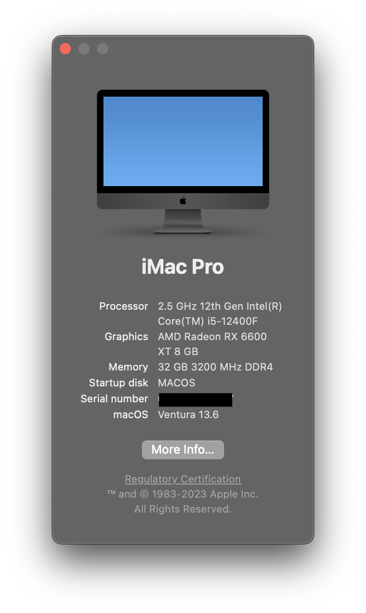
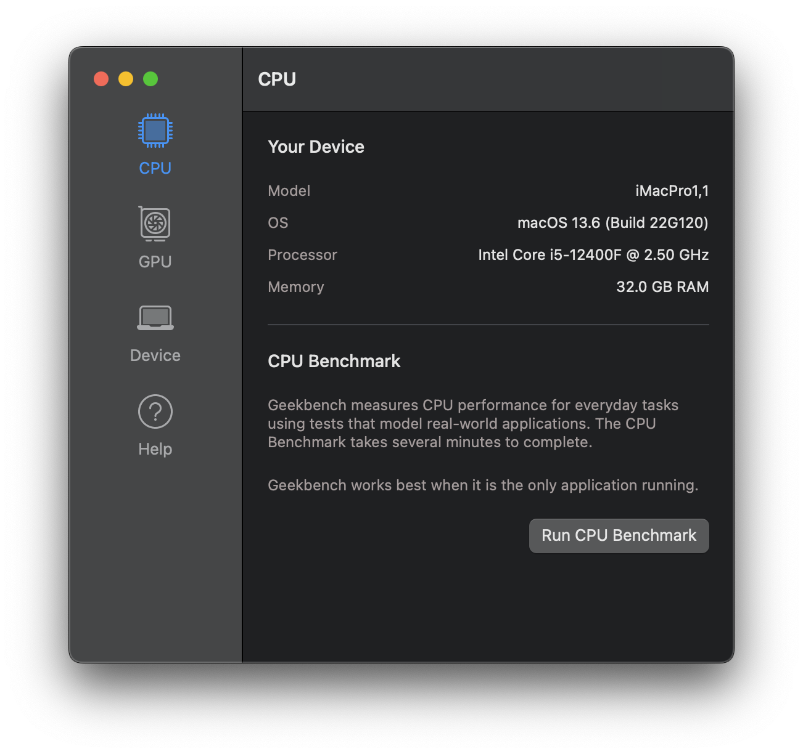
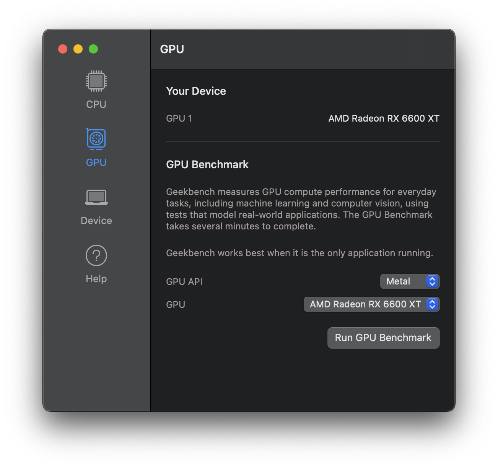
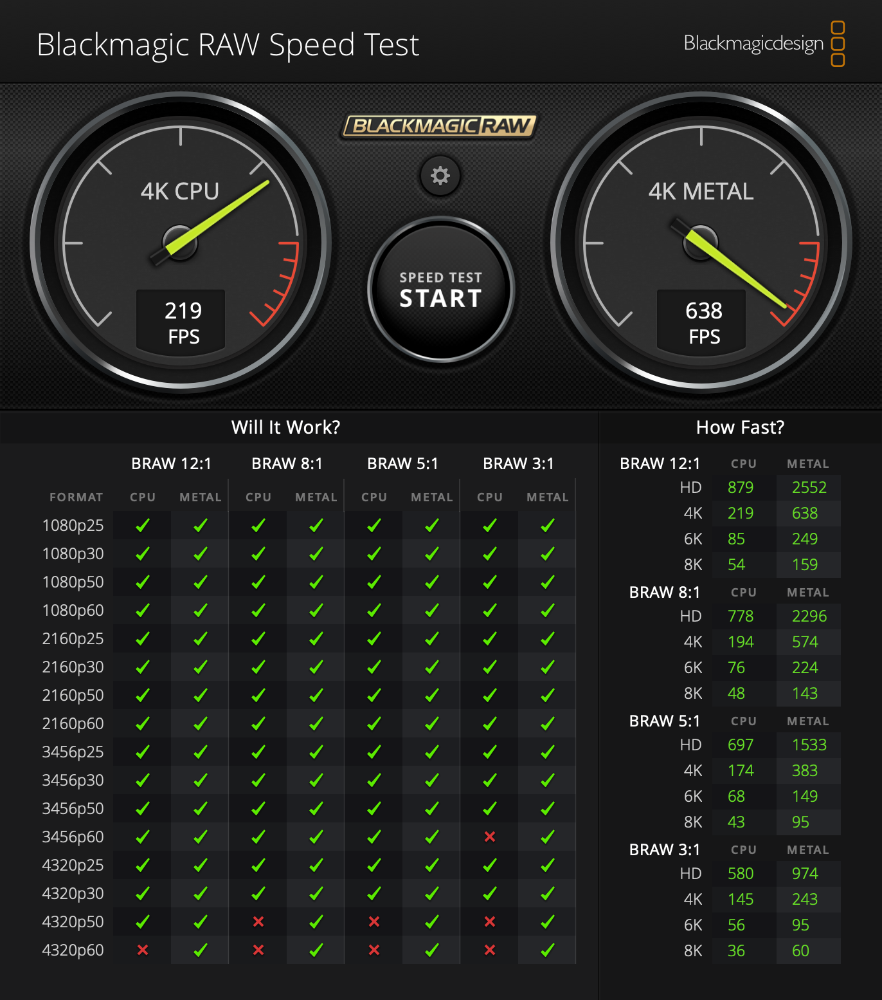
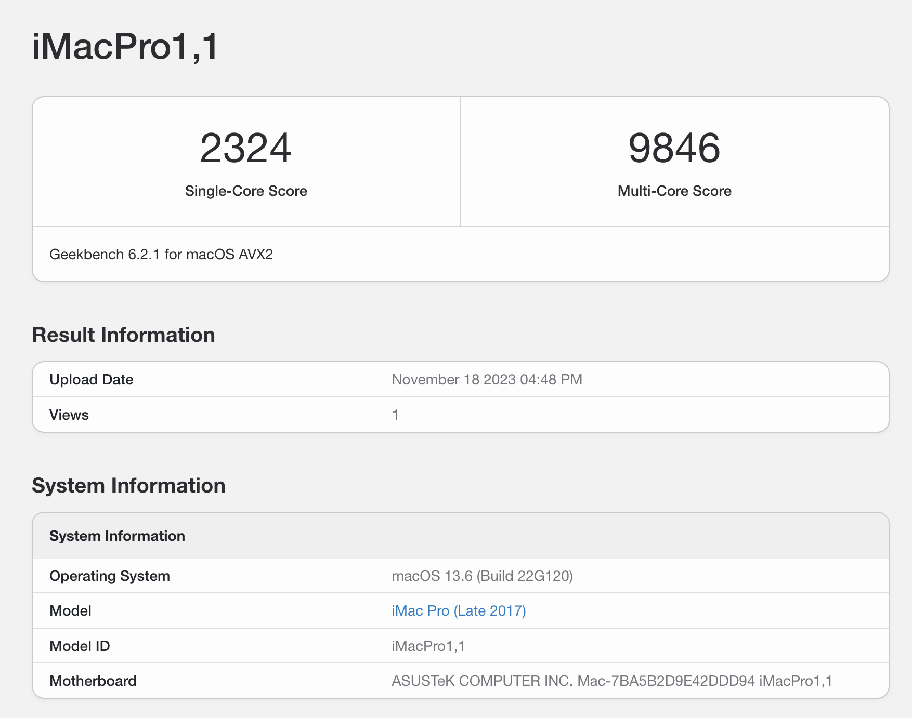
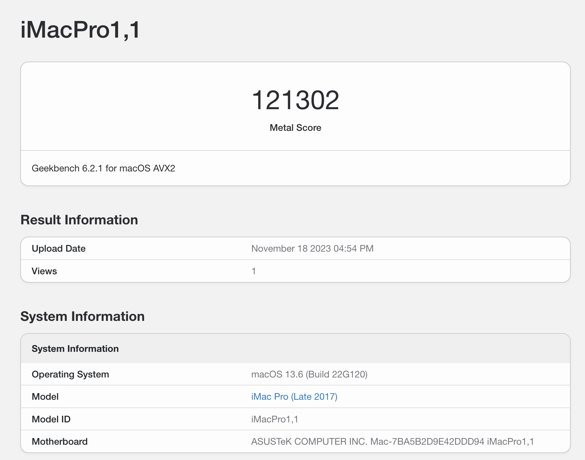
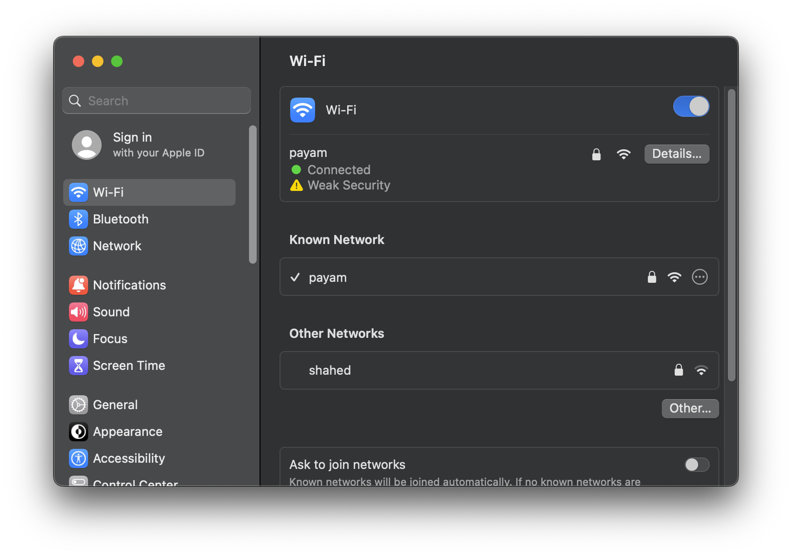
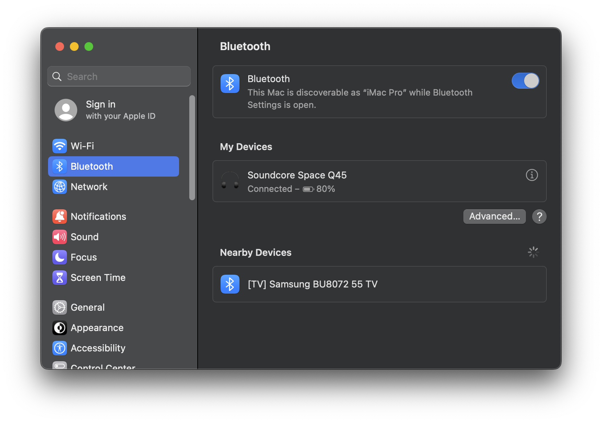
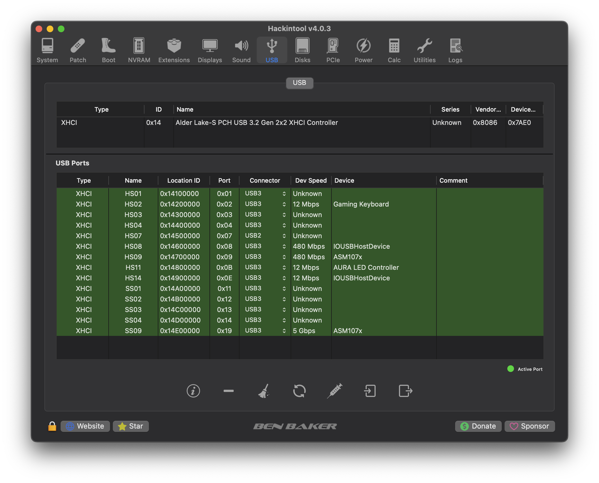

# Hackintosh 12400F-Asus-B660MA-Wifi-RX6600XT

# Current Versions

- [Current Mac Version: macOS Ventura 13.6 (Olarila Image)]("https://www.olarila.com/")
- [Current OpenCore Version: 0.9.6]("https://dortania.github.io/OpenCore-Install-Guide/")

# Hardware
- CPU: i5-12400F Stock Cooler
- Board: [Asus B660M-A Wifi D4]("https://www.asus.com/motherboards-components/motherboards/prime/prime-b660m-a-wifi-d4/")
- RAM: [32 GB (2x16GB) Corsair VENGEANCE® RGB PRO]("https://www.corsair.com/us/en/p/memory/cmw32gx4m2d3600c18/vengeancea-rgb-pro-32gb-2-x-16gb-ddr4-dram-3600mhz-c18-memory-kit-a-black-cmw32gx4m2d3600c18")
- GPU: [ASUS ROG STRIX RX6600XT O8G GAMING]("https://rog.asus.com/graphics-cards/graphics-cards/rog-strix/rog-strix-rx6600xt-o8g-gaming-model/")
- SSD: [XPG SPECTRIX S40G RGB PCIe Gen3x4 M.2]("https://www.xpg.com/us/xpg/610")
- PSU: [Cooler Master 700 Bronze]("https://www.coolermaster.com/catalog/power-supplies/mwe-series/mwe-700-bronze-v2")
- Wifi/BT: Intel AX201 (Motherboard WIFI/BT)

Hint: Cpu renamed By [Cpu Rename]("https://github.com/corpnewt/CPU-Name")

# Working
- CPU
- GPU
- USB Ports
- Wifi/BT

# About

# Benchmark (BlackmagicRAWSpeedTest 4k)

# Benchmark (GEEKBENCH 6)

# WIFI/BT

# USB Port Mapping
